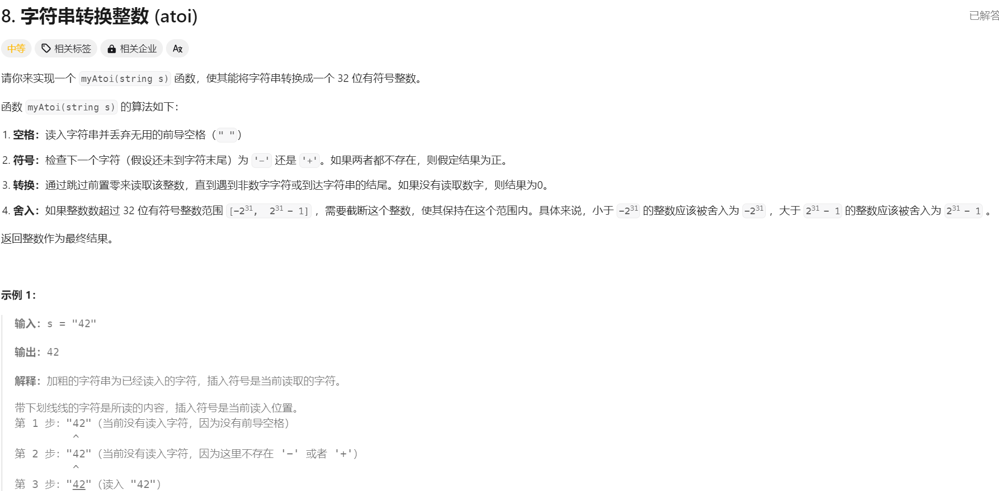

---

---

# chapter 1 .数学


##  1.取最小公倍数

- **题目描述**:给出两个整数,求出两个整数的最小公倍数

###     方法Ⅰ:暴力枚举

   从大数开始枚举,容易超时。


###      方法Ⅱ: 欧几里得算法(求最大公约数)

$$
LCM(n,m)=\frac{n*m}{GAC(n,m)}
$$

- LCM为最小个公倍数

- GAC为最大公约数 

  那么该公式在代码实现上需要注意什么呢?

     首先是**整数溢出**的问题：在运算过程中若先调用（n*m）很容易出现**整数溢出的情况**这时，应当考虑先除后乘**减小运算过程中的中间数值**

    同时res=LCM(n，m)应当尽量取long long int 考虑**n=100001 m=100000**的情况

  

  **那么剩下的问题就是如何取最大公约数？**

  ###  欧几里得算法：

  思想：若两数为n与m（n>m),那么**k=(n-m)**也必然为其**最大公约数的整数倍**，那么**k与m的最大公约数也为GAC**

  

####                   欧几里得算法代码实现

```C++
int gcd(int n ,int m)
{ 
   //假定n为大数
   while(m!=0)
   {
      int temp = n%m;
      n= m;
      m= temp;
   }
    //当循环结束 大数为所需的值,小数为0
   return n;
}
```

考虑m>n?  **yy**一下,很好想到,在m>n时,while循环内部操作其实就相当于进行了**一次交换**操作妙不妙!!!!!

-   递归实现

```c++
int gcd(int n ,int m)
 {
   if(m==0) return n;
   else return(gcd(m,n%m));
 }
```


___


## 2. leeetcode.7*整数反转(爆int)(非常重要)*

###  

https://leetcode.cn/problems/reverse-integer/description/


####    鄙人在一开始解题时犯的错误：

1. 没有想到用一个sign来记录x的正负，导致后面需要重复确认x的正负
2. 本来想用temp来承接|x| ,但是没有想到 **|-2^31|会直接导致整型溢出**!! 
3. 没有考虑到在进行运算的过程中如果出现**中间值大于int的范围**,也会发生整型溢出

   题目要求：若反转后超出int范围直接返回0

```c++
if(sign<0 && res*10+temp< INT_MIN) return 0 ; //其中temp为当前位上的数值[0,9]
if (sign >0 && res*10 -temp>INT_MAX) return 0;
```

这样写确实满足了如果说res将要转化的值将要超出int范围 ,直接return 0 ;

**但是!!! ,有没有考虑到在res*10本身也有可能发生爆int!!!**即在运算过程中发生整数溢出。

解决方案: **运算右移即可**

```c++
if(sign<0 && res< (INT_MIN+temp)/10） return 0 ; //其中temp为当前位上的数值[0,9]
if(sign >0 && res> (INT_MAX-temp)/10) return 0;
```

####     题解:

```c++
class Solution {
public:
    int reverse(int x) {
          int res =0
          int sign = (x>0)? 1:-1;
          while(x!=0) //x<0也可以进行取余运算
          {
              int temp = sign*(x%10) //sign 保证了temp只反映位上数值大小[0.9]
              if(sign<0 &&　res< (INT_MIN+temp)/10） return 0 ;
              if(sign >0 && res> (INT_MAX-temp)/10) return 0 ;
              x/=10;
              res = res*10 +sign*temp //因为res为负数 实际上是减去一个temp
          }
          return res;
    }
};
```

####     收获:

- 运算过程中发生整数溢出,如果需要比较可以**考虑算术右移**
- sign表示输入的正负,还可以方便后续赋值操作!!
- 负数也可以进行区取余运算

## 3.leetcode.8[字符串转整数](https://leetcode.cn/problems/string-to-integer-atoi/description/)



根据题目描述,结果应当符合如下规则:

- 字符串前置空格可以直接跳过。

- 跳过空格后**只要对首个非空字符串识别是否为'+' '-'** ,

  若为'-'则sign=-1,且索引+1 若为'+'不处理,因为默认的sign=1(记得索引+1)

  若为其他字符串,交给while循环处理

- while循环负责处理整数问题:

  - 如果遇到非数字部分,直接跳出循环

  - 如果遇到数字部分:

    - res=0 且 s[index]='0': 此时跳过该字符

    - 其他: 写入 (注意:写入需要判断会不会爆int!!!!处理方式与leetcode7很像),

    - 注意**字符的转int型:**
      $$
      temp = ascii(s[index]) - ascii('0')
      $$
      

​                                              

###             3.2 完整实现:

```c++
class Solution {
    //如果读取的第一个字符后直接停止
public:
    int myAtoi(string s)
    {
           int index =0 ;
           int sign=1;//default
           int res =0;
           int res_len =0;
           int temp =0;
           while(s[index]==' ' && index<s.length()) 
           {index++;}
           if(s[index]=='+') index++;
           else if(s[index]=='-') 
           {
             sign=-1;
             index++;
           }
           while(index <s.length())
           {
             if(s[index]=='+'||s[index]=='-'||s[index]=='.'
                           ||s[index]==' '||isalpha(s[index]))                      
             {  
                break;
             }
             else if(isdigit(s[index]))
             {
                if(res_len==0&& s[index]=='0')
                 {  
                    index++;
                    continue;
                 }
                else 
                {
                    temp = s[index]-'0';  //记录下来
                    if(res<=(INT_MAX-temp)/10 && sign ==1)
                          {res= res*10+temp*sign; //注意需要乘sign 如果不乘想留在return乘会爆int
                          res_len++;}
                    else if(res>(INT_MAX-temp)/10 && sign==1) return INT_MAX ;
                    if(res>=(INT_MIN+temp)/10 && sign ==-1)
                        { res = res*10+temp*sign; 
                          res_len++;}
                    else if(res<(INT_MIN+temp)/10&& sign ==-1) return INT_MIN;
                }
             }
             index++;
           }
           return res;     
    }
};
```


## 4.二分法


### 4.1 二分查找  [leetcode.704](https://leetcode.cn/problems/binary-search/description/) 


- 当进行二分查找时需要明确区间范围的开与闭,这样在编代码时,才能明确各种比较的写法:

- 二者对比:

  ```c++
  int search()
  {
      int left = 0 , right = numsSize;
      int res =0;
      int mid ;
      while(left<=right)
      {
          mid = (left+right)/2 ;//这里无需考虑爆int情况 因为索引小于INT_MAX
          if(nums[mid] >target)
          {
              right = mid-1;    
          }
          else if(nums[mid]<target)
          {
              left = mid+1;
          }
          else return mid;
      }
      /*左闭右开
      while(left<right)
      {
        if(nums[mid]<target)
        {
           right = mid;
        }
        else if(nums[mid]<target)
          {
              left = mid+1;
          }
        else return mid;
      }
      */
      return -1
  }
  ```

- 其实只要注意到while循环内部的条件实际上指的是左右边界应当使得**区间有效**!!

  递归写法(可以课后实现一下)


### 4.2 二分查找的变式[leetcode.69](https://leetcode.cn/problems/sqrtx/)


```c++
class Solution {
public:
    int mySqrt(int x) {
       int mid ;
       int left =0 ,right = x ;
       int ans ;
       while(left<=right)
       {
          //在本题中中间数就是索引
          mid = left+ (right - left)/2 ; //很细节防止爆int
          if((long long)mid*mid <= x)
          {
             ans = mid;//结果暂存
             left = mid+1;
          }
          else 
          {
            right = mid-1;
          }
       } 
       return ans;
    }
};
```

- ##### 最重要的是理解while循环内if((long long )mid*mid <=x)

  - long long 类型强制转换防止爆int

  - **mid *mid <= x**? why?

    很容易知道: 最终结果ans的平方要么会等于x 要么会小于x(只取了x开平方的整数部分)。 因此在if内部需要**对ans进行赋值操作**。

    我们设想一下:假设某一次mid正好指向了所需要的ans那么 ,执行第一次边界变换:left=mid+1   **由于此后,只会存在mid的平方大于x的情况,**因此在最后会有**right<left**导致循环结束 return ans

  

### 4.2快速幂(二分加速)

- 适用场景: 一般是求a^b ,且题目会给一个数字让你求出a^b对其求余的结果,如果说直接暴力计算,不说会造成高时间成本,还会有**整数溢出的风险**

​    这时二分加速就派上了用场。

   求出a^b的二分加速方法(不考虑爆int的情况好吧,且a>=1, b>0)

```c++
int b_speed_up(int a ,int b)
{
    int res =1;
    if(b==0) return 1;
    while(b>0)
    {
        if(b%2>0) res*= a ;
        else 
        {
            a = a*a;
            b/=2;
        }
    }
    return res ;
}
```


### 4.3快速乘(也是二分加速)[leetcode.29两数相除](https://leetcode.cn/problems/divide-two-integers/description/)


- #### 思路:

  1. 用二分查找,不断逼近最终的返回值
  2. 如何逼近返回值 ,用快速乘判断 当前中间指针所指的数是小是大?
  3. 那么由于二分查找啊的范围是在[1,INT_MAX]之间,(后续会根据情况,调整正负),那么这就需要在正式开始二分查找之前判断好INT_MIN 以及为0 的一些情况;

####    4.3.1 快速乘在本题中的具体实现:

```c++
public:
    bool quick_add(int divisor ,int res, int dividend)
    {
     // 需要满足divisor *res >= dividend  注意divisor 和dividend都是负数!!!!
        int add =divisor;
        int ans =0;
        while(res  )
        {
            if(res & 1 ) //判断res 是否为奇数 
            {
                if(ans <dividend-add) return false ;
                ans += add;
            }
            if(res != 1)//注意这里!!!
            {
              if(add < dividend-add)　return false ;  //会存在 add*2>dividend的情况
              add +=add ;
            }
            res>>=1; //相当于res/=2  <-> res = res>>1
        }
        return true;
    }
```

####     4.3.2主体的代码实现

```c++
public:
    int divide(int dividend, int divisor) 
    {
        //考虑被除数为最小值的情况
          if (dividend == INT_MIN) {
            if (divisor == 1) {
                return INT_MIN;
            }
            if (divisor == -1) {
                return INT_MAX;
            }
        }
        // 考虑除数为最小值的情况
        if (divisor == INT_MIN) {
            return dividend == INT_MIN ? 1 : 0;
        }
        // 考虑被除数为 0 的情况
        if (dividend == 0) {
            return 0;
        }

        bool if_negative = false ;
        if(dividend>0)
         {
            if_negative = !if_negative;
            dividend = -dividend;
        }
        if(divisor> 0) 
        {
            if_negative = !if_negative;
            divisor = -divisor;
        }

        int left = 1  , right = INT_MAX;
        int ans =0 ;
        while(left<= right)
        {
            int mid = left + ((right-left)>>1);
            if(quick_add(divisor, mid , dividend))
            {
                ans = mid;
                if(mid==INT_MAX) break;
                left = mid + 1 ;
            }
            else right = mid-1;
        }
        return (if_negative) ? -ans: ans;
        
    }
```


## 5.找素数

###    5.1 记录素数的个数  [leetcode.24](https://leetcode.cn/problems/count-primes/description/)


####  5.1.1 暴力 (从根号n之前开始逐个筛选)

```c++
class Solution {
public:
    bool is_primer(int i )
    {
        for(int j = 2 ; j<=sqrt(i);j++)
        {
            if(i % j== 0) return false ;
        }
        return true ;
    }
    int countPrimes(int n) 
    {
        int count  =0;
        if(n<=2 ) return 0 ;
        for (int i =2 ;i<n ;i++)
        {
            if (is_primer(i)) count++;
        }
        return count;
    }
};
```

- 一个数如不是质数,则必存在一个因数会小于  sqrt(i) , 因此我们只需要遍历   [2 , sqrt(n) ]即可

  故在is_primer中遍历:

  ```c++
  for(int j =2 ; j<=sqrt(i);j++)
  {
      ....
  }
  ```

- #### 问题:

  由于时间复杂度为:
  $$
  O(n*\sqrt{n})
  $$
  **容易产生超时**:

  

####   5.1.2 埃氏筛法

- 埃氏筛法:
  埃拉托色尼筛选法，简称埃氏筛法， 是针对自然数列中的自然数而实施的，用于求一定范围内的质数。也就是给定整数n，求小于n的所有质数（素数）。
  埃拉托斯特尼筛法，简称埃氏筛或爱氏筛，是一种由希腊数学家埃拉托斯特尼所提出的一种简单检定素数的算法。要得到自然数n以内的全部素数，必须把不大于根号n的所有素数的倍数剔除，剩下的就是素数。

- 埃氏筛法的基本思想 ：从2开始，将每个质数的倍数都标记成合数，以达到筛选素数的目的。

- 埃氏筛法的缺陷 ：对于一个合数，有可能被筛多次。例如 30 = 215 = 310 = 5*6……（那么如何确保每个合数只被筛选一次呢？我们只要用它的最小质因子来筛选即可）。

```c++
class Solution {
public:
    int countPrimes(int n) 
    {
        int count = 0 ; 
        bool is_primer[n];
        for(int i = 0 ;i<n;i++)
        {
            is_primer[n]=true; //这里不大严谨 0 ,1 就不考虑了 遍历的时候也不会遍历
        }
        for(int i = 2 ;i<n ;i++)
        {
            if(is_primer[i]) 
            {
                count ++ ; //注意2 本身就是质数
                for(int j = i+i ; j<n;j+=i) //不要写成(int  j =2 ;i<n ;j++)
                {
                     is_primer[j] = false ;
                }
             }
        }
        return count;
    }
};
```

